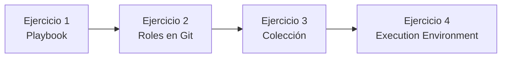

# Laboratorio OpenShift Dev Spaces — Ansible

Guía continuada de los cuatro ejercicios prácticos. Sigue el orden de esta página: el contenido detallado de cada ejercicio está en el **README de su propio repositorio**, no en este índice.

**English version:** [README_EN.md](README_EN.md)

---

## Cómo se despliegan los ejercicios

Cada ejercicio se **despliega por separado** en **Red Hat OpenShift Dev Spaces**: un repositorio Git distinto y un **workspace Dev Spaces distinto**. No se espera tener todos los ejercicios abiertos a la vez ni como carpetas hermanas en un mismo proyecto.

Flujo habitual:

1. Abre el **dashboard de Dev Spaces** del laboratorio.
2. **Crea o arranca un workspace** a partir del repositorio Git del ejercicio que toque (`lab-devspaces-ansible-exercise1`, luego `…-exercise2`, etc.). Cada repositorio incluye su `devfile.yaml`.
3. Cuando el workspace esté listo, abre el **`README.md`** (o **`README_EN.md`**) en la **raíz de ese proyecto**. Ahí está la guía paso a paso.
4. Al terminar, pasa al siguiente ejercicio **creando otro workspace** con el repositorio siguiente. El hilo pedagógico es el mismo (WildFly / Ansible); el entorno de desarrollo no se comparte entre ejercicios.

Este repositorio (`lab-devspaces-ansible-instruction`) es solo el **mapa del laboratorio**. Úsalo para el orden y el índice de secciones; el trabajo práctico se hace dentro del workspace de cada ejercicio.

---

## Itinerario

El laboratorio construye, paso a paso, el mismo hilo de automatización: un despliegue de **WildFly** sobre una VM Fedora, cada vez con más estructura Ansible.

| Orden | Repositorio Git (workspace Dev Spaces) | Qué aprendes | Guía en ese workspace |
| ----- | -------------------------------------- | ------------ | --------------------- |
| 1 | `lab-devspaces-ansible-exercise1` | Playbook monolítico, refactor con `tags`/`block`, roles locales, calidad y firma | `README.md` · `README_EN.md` |
| 2 | `lab-devspaces-ansible-exercise2` | Extraer un rol a un repositorio Git y consumirlo con `requirements.yml` | `README.md` · `README_EN.md` |
| 3 | `lab-devspaces-ansible-exercise3` | Estructura de una colección, módulo propio, `ansible-test` y cobertura | `README.md` · `README_EN.md` |
| 4 | `lab-devspaces-ansible-exercise4` | Definir, construir y ejecutar un Execution Environment con ansible-navigator | `README.md` · `README_EN.md` |

**Cómo encajan entre sí**

1. En el **ejercicio 1** escribes y refactorizas el playbook de WildFly hasta roles locales, linters, Molecule y `ansible-sign`.
2. En el **ejercicio 2** sacas uno de esos roles (p. ej. `wildfly_os_deps`) a un Git independiente y lo instalas con `ansible-galaxy`.
3. En el **ejercicio 3** subes de nivel: una **colección** agrupa módulos, roles y tests bajo un FQCN.
4. En el **ejercicio 4** empaquetas el runtime (colecciones, Python, `oc`, etc.) en una **imagen EE** y ejecutas playbooks dentro de ella.

Antes de cada ejercicio, **crea el workspace Dev Spaces** del repositorio indicado (cada uno trae su `devfile.yaml`, salvo que el formador indique otra imagen). El índice de secciones de abajo coincide con los títulos de ese `README.md`.

---

## Ejercicio 1 — Playbooks, roles locales y calidad

**Repositorio Git / workspace Dev Spaces:** `lab-devspaces-ansible-exercise1`  
**Guía completa:** en ese workspace, `README.md` (castellano) o `README_EN.md` (inglés).

Curso práctico: el fichero de referencia `deploy-wildfly.yaml` es el resultado objetivo. Construyes el playbook, lo refactorizas y lo validas.

### Índice de la guía

- Preparación del entorno
- 1. Contexto: qué hace `deploy-wildfly.yaml`
- Inventario: host de la VM Fedora en OpenShift
- 2. Guía paso a paso (primer playbook monolítico)
  - Paso 1 — Cabecera del play
  - Paso 2 — Variables del play (`vars`)
  - Paso 3 — Dependencias del sistema
  - Paso 4 — Grupo de sistema para WildFly
  - Paso 5 — Usuario de sistema para WildFly
  - Paso 6 — Descarga e instalación del producto
  - Paso 7 — Limpieza del enlace o directorio destino
  - Paso 8 — Enlace simbólico a la versión concreta
  - Paso 9 — Escucha en todas las interfaces
  - Paso 10 — Script de arranque para systemd
  - Paso 11 — Unidad systemd
  - Paso 12 — Directorio y fichero de configuración del servicio
  - Paso 13 — Arranque y habilitación del servicio
  - Paso 14 — (Opcional) Firewall
  - Paso 15 — Aplicación de ejemplo
- 3. Refactorización con `tags` y `block`
  - 3.1 Etiquetas (`tags`)
  - 3.2 Bloques (`block`)
- 4. Roles, variables y handlers
  - 4.1 Esquema sugerido de roles
  - 4.2 Variables
  - 4.3 Handlers
  - 4.4 Playbook que llama a los roles
- 5. Calidad: yamllint, ansible-lint y Molecule
  - 5.1 yamllint
  - 5.2 ansible-lint
  - 5.3 Molecule
- 6. Firma del proyecto con `ansible-sign`
  - Contraseña de laboratorio (frase de paso GPG)
  - 6.1 Requisitos e instalación
  - 6.2 Par de claves GPG para firmar
  - 6.3 `MANIFEST.in`
  - 6.4 Firmar el proyecto
  - 6.5 Verificar la firma
- Resumen
- Comandos auxiliares

**Antes de pasar al ejercicio 2:** playbook (o roles locales) equivalente a la referencia, inventario de tu VM Fedora y, si el formador lo pide, linters / Molecule / firma.

---

## Ejercicio 2 — Roles reutilizables en Git

**Repositorio Git / workspace Dev Spaces:** `lab-devspaces-ansible-exercise2`  
**Guía completa:** en ese workspace, `README.md` (castellano) o `README_EN.md` (inglés).

Partes de los roles del ejercicio 1: publicas uno en un repositorio Git propio y lo consumes desde el playbook con `ansible-galaxy` y `requirements.yml`.

### Índice de la guía

- ¿Qué es un rol en Ansible?
  - Estructura típica de un rol
  - Carpetas y ficheros
- En qué consiste este laboratorio
  - Objetivos concretos
- Prerrequisitos
- Parte A — Crear el repositorio del rol
  - A.1 Crear el repositorio vacío en la forja
  - A.2 Clonar y estructura en la raíz del repo
  - A.3 Contenido de `tasks/main.yml`
  - A.4 Contenido de `defaults/main.yml`
  - A.5 `meta/main.yml`
  - A.6 Primer commit y push
- Parte B — Consumir el rol desde el playbook
  - B.1 Quitar el rol duplicado
  - B.2 Crear `requirements.yml`
  - B.3 Instalar roles
  - B.4 Configurar `ansible.cfg`
  - B.5 Playbook que referencia el rol
  - B.6 Verificación
- Resumen de pasos (checklist)
- Notas prácticas
- Resultado esperado

**Antes de pasar al ejercicio 3:** el rol vive en Git; el playbook lo declara en `requirements.yml` y lo instala con `ansible-galaxy` (sin copiar el árbol del rol en el repo del playbook).

---

## Ejercicio 3 — Colecciones Ansible

**Repositorio Git / workspace Dev Spaces:** `lab-devspaces-ansible-exercise3`  
**Guía completa:** en ese workspace, `README.md` (castellano) o `README_EN.md` (inglés).

Una colección empaqueta módulos, roles, playbooks y tests bajo un espacio de nombres (`namespace_example.collection_example`). Recorre la plantilla y ejecuta `ansible-test`.

### Índice de la guía

- ¿Qué es una colección de Ansible?
- Objetivo de este laboratorio
- Contenido de `template-ansible-collection-develop`
  - Rol incluido: `get_server_example_role`
  - Módulo y código de soporte (plugins)
  - Otras carpetas útiles para orientarse
- Entorno (OpenShift Dev Spaces)
- Pruebas con `ansible-test` y cobertura
  - Sanidad (`sanity`)
  - Pruebas unitarias (`units`)
  - Pruebas de integración (`integration`)
  - Informes de cobertura de código
- Referencias

**Antes de pasar al ejercicio 4:** has localizado rol, módulo y tests en el árbol de la colección y has ejecutado al menos `ansible-test` (sanity y/o units) desde el directorio de `galaxy.yml`.

---

## Ejercicio 4 — Execution Environments

**Repositorio Git / workspace Dev Spaces:** `lab-devspaces-ansible-exercise4`  
**Guía completa:** en ese workspace, `README.md` (castellano) o `README_EN.md` (inglés).

Generas una imagen EE con `ansible-builder` y ejecutas playbooks con `ansible-navigator` desde Dev Spaces.

### Índice de la guía

- ¿Qué es un Execution Environment?
- Claves del fichero de definición (Ansible Builder 3.x)
  - `version`
  - `images`
  - `dependencies`
  - `build_arg_defaults`
  - `additional_build_files`
  - `additional_build_steps`
  - `options`
- Contenido práctico del laboratorio
- Requisitos en DevSpaces
- Parte 1 — Revisar los ficheros del Execution Environment
  - 1.1 `ee-example.yml`
  - 1.2 `ee-example-not-exec.yml`
- Parte 2 — Generar el contexto de build (`create`)
  - Revisar el contexto generado
- Parte 3 — Build de la imagen y publicación
  - 3.1 Build con `ee-example.yml`
  - 3.2 Build con `ee-example-not-exec.yml`
- Parte 4 — ansible-navigator con la imagen ya publicada
  - 4.1 Playbook contra Fedora
  - 4.2 Playbook contra la API de OpenShift
- Parte 5 — Cambios recomendados para un cluster OpenShift real
  - `test-exec-fedora.yaml` + `inventory`
  - `test-exec-openshift.yaml`
- Notas — Comandos de referencia

**Cierre del laboratorio Dev Spaces:** has descrito un EE, generado contexto/imagen y ejecutado un playbook dentro de esa imagen (`--eei`).

---

## Material de apoyo (fuera de esta ruta)

Los repositorios siguientes no forman parte de estos cuatro ejercicios; el formador los usa para el aprovisionamiento del clúster o para el laboratorio de AAP:

- `lab-devspaces-ansible` — instalación de Dev Spaces, virtualización, Gitea y VMs.
- `lab-aap-ansible` / `lab-aap-ansible-exercise1` / `lab-aap-ansible-instruction` — Ansible Automation Platform.
