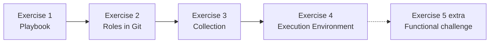

# OpenShift Dev Spaces lab — Ansible

Continuous guide for the **four hands-on exercises** and an **extra challenge** (exercise 5). Follow the order on this page: below the learning path you will find the **full guide** for each exercise (the same as the `README.md` / `README_EN.md` in its repository).

---

## How the exercises are deployed

Each exercise lives in **its own Git repository**. The usual lab start is **a single workspace** created from the instruction repository (*Accessing Dev Spaces* section): the `devfile.yaml` clones every project. Work in the folder of the exercise you are on and open its `README.md`. You can also create a workspace from a single exercise repo if the instructor says so.

Typical flow:

1. Sign in to Dev Spaces and **start the workspace** from **your** instruction repo URL (*Accessing Dev Spaces* section). Paths and the login user depend on the account you use.
2. In the explorer, open the exercise repository (`lab-devspaces-ansible-exercise1`, then `…-exercise2`, and so on; the extra challenge is `…-exercise5`).
3. Open **`README.md`** (or **`README_EN.md`**) at the **root of that project**. For exercises 1–4 that is the step-by-step guide; for exercise 5 it is the challenge requirements.
4. When you finish, move to the next exercise **in the next folder** (same workspace). If you prefer one workspace per exercise, create another from that repository URL.

This repository (`lab-devspaces-ansible-instruction`) is the **lab map** and the **workspace entry point**. Use it for the order and the section index; the practical work happens inside each exercise folder.

---

## Learning path

The lab builds, step by step, the same automation thread: a **WildFly** deployment on a Fedora VM, each time with more Ansible structure.

| Order | Git repository (Dev Spaces workspace) | What you learn | Guide in that workspace |
| ----- | ------------------------------------- | -------------- | ----------------------- |
| 1 | `lab-devspaces-ansible-exercise1` | Monolithic playbook, refactor with `tags`/`block`, local roles, `files/`/`templates/`, quality and signing | `README.md` · `README_EN.md` |
| 2 | `lab-devspaces-ansible-exercise2` | Move a role into this repository and consume it from exercise 1 with `requirements.yml` | `README.md` · `README_EN.md` |
| 3 | `lab-devspaces-ansible-exercise3` | Collection structure, custom module, `ansible-test` and coverage | `README.md` · `README_EN.md` |
| 4 | `lab-devspaces-ansible-exercise4` | Define, build and run an Execution Environment with ansible-navigator | `README.md` · `README_EN.md` |
| Extra | `lab-devspaces-ansible-exercise5` | Challenge: analysis and development (Hello World on WildFly, collection lifecycle, team EE) | `README.md` · `README_EN.md` |

**How they fit together**

1. In **exercise 1** you write and refactor the WildFly playbook into local roles, linters, Molecule and `ansible-sign`.
2. In **exercise 2** you take one of those roles (e.g. `wildfly_os_deps`) into this Git repo and install it with `ansible-galaxy` from exercise 1.
3. In **exercise 3** you go one level up: a **collection** groups modules, roles and tests under an FQCN.
4. In **exercise 4** you package the runtime (collections, Python, `oc`, etc.) into an **EE image** and run playbooks inside it.
5. **Exercise 5** is **optional**: a challenge for whoever finishes the rest; there is no step-by-step recipe.

Before each exercise, **open that repository folder** in the workspace (the instruction `devfile.yaml` already cloned it; each exercise also ships its own if you start a separate workspace). The section index below matches the headings of that `README.md`.

---

## Exercise 1 — Playbooks, local roles and quality

**Git repository / Dev Spaces workspace:** `lab-devspaces-ansible-exercise1`  
**Full guide:** in that folder, `README_EN.md` (English) or `README.md` (Spanish). It is also further down on this page.

This exercise is designed to be completed **inside OpenShift Dev Spaces**. The repository **does not include** `deploy-wildfly.yaml`: you build it by assembling the YAML snippets from the guide.

### Guide index

- Environment setup
- 1. Context: what `deploy-wildfly.yaml` does
- Inventory: Fedora VM host on OpenShift
- 2. Step-by-step guide (first monolithic playbook)
  - Step 1 — Play header
  - Step 2 — Play variables (`vars`)
  - Step 3 — System dependencies
  - Step 4 — System group for WildFly
  - Step 5 — System user for WildFly
  - Step 6 — Download and install the product
  - Step 7 — Clean the destination link or directory (if applicable)
  - Step 8 — Symbolic link to the specific version
  - Step 9 — Listen on all interfaces
  - Step 10 — Startup script for systemd
  - Step 11 — systemd unit
  - Step 12 — Service configuration directory and file
  - Step 13 — Start and enable the service
  - Step 14 — (Optional) Firewall
  - Step 15 — Sample application
- 3. Second part: refactoring with `tags` and `block`
  - 3.1 Tags (`tags`)
  - 3.2 Blocks (`block`)
- 4. Third part: roles, variables and handlers
  - 4.1 Suggested role layout
  - 4.2 Variables
  - 4.3 Handlers
  - 4.4 Playbook that calls the roles
  - 4.5 Static files (`files/`) and Jinja2 templates (`templates/`)
- 5. Quality: yamllint, ansible-lint and Molecule
  - 5.1 yamllint
  - 5.2 ansible-lint
  - Intentional nits (yamllint and ansible-lint)
  - 5.3 Molecule (playbook test)
    - 5.3.1 Scenario `default` — test VM on OpenShift
    - 5.3.2 Scenario `with_existing_machine` — lab VM
    - 5.3.3 Run the Molecule tests
- 6. Signing the project with `ansible-sign`
  - Lab password (GPG passphrase)
  - 6.1 Requirements and installation
  - 6.2 GPG key pair for signing
  - 6.3 `MANIFEST.in`: which files go into the signature
  - 6.4 Sign the project
  - 6.5 Verify the signature
- Summary
- Auxiliary commands

**Before moving to exercise 2:** playbook (or local roles) equivalent to the reference, inventory for your Fedora VM, and, if the instructor requires it, linters / Molecule / signing.

---

## Exercise 2 — Reusable roles in Git

**Git repository / Dev Spaces workspace:** `lab-devspaces-ansible-exercise2`  
**Full guide:** in that folder, `README_EN.md` (English) or `README.md` (Spanish). It is also further down on this page.

You **move** the `wildfly_os_deps` role created in exercise 1 into **this** repository and **call it from exercise 1** with `ansible-galaxy` and `requirements.yml`. Do not create an empty forge repository: use the exercise2 clone.

### Guide index

- What is an Ansible role?
  - Typical role structure
  - Folders and files
- What this lab consists of
  - Concrete objectives
- Prerequisites
- Part A — Move the role into `lab-devspaces-ansible-exercise2`
  - A.1 This repository is the role repository
  - A.2 Move the content from exercise 1
  - A.3 Contents of `tasks/main.yml`
  - A.4 Contents of `defaults/main.yml`
  - A.5 Contents of `vars/main.yml` (role constants)
  - A.6 `meta/main.yml` (role metadata)
  - A.7 Publish the role files
- Part B — Call the role from `lab-devspaces-ansible-exercise1`
  - B.1 Remove the local role from exercise 1
  - B.2 `requirements.yml` at the exercise1 root
  - B.3 Install the role in the playbook project
  - B.4 Configure `ansible.cfg` (recommended)
  - B.5 Complete playbook (external role + local roles)
  - B.6 Verification from exercise 1
- Part C — Role tests, yamllint and ansible-lint
  - C.1 Test playbook (`tests/test.yml`)
  - C.2 How to run it
  - C.3 yamllint
  - C.4 ansible-lint
- Part D — Molecule: test the role test playbook
  - D.1 Scenario `default` — test VM on OpenShift
  - D.2 Scenario `with_existing_machine` — lab VM
  - D.3 Run Molecule
- Step summary (checklist)
- Practical notes
- Expected result

**Before moving to exercise 3:** the role lives in Git; the exercise 1 playbook declares it in `requirements.yml` and installs it with `ansible-galaxy` (without copying the role tree into the playbook repo).

---

## Exercise 3 — Ansible collections

**Git repository / Dev Spaces workspace:** `lab-devspaces-ansible-exercise3`  
**Full guide:** in that folder, `README_EN.md` (English) or `README.md` (Spanish). It is also further down on this page.

A collection packages modules, roles, playbooks and tests under a namespace (`namespace_example.collection_example`). Walk the template and run `ansible-test`.

### Guide index

- What is an Ansible collection?
- Goal of this lab
- Contents of `template-ansible-collection-develop`
  - Included role: `get_server_example_role`
  - Module and supporting code (plugins)
  - Other useful folders for orientation
- Environment (OpenShift Dev Spaces)
- Tests with `ansible-test` and coverage
  - Install the collection
  - Sanity (`sanity`)
  - Unit tests (`units`)
  - Integration tests (`integration`)
  - Sample playbook
  - Code coverage reports
- Summary (checklist)
- Expected result
- References

**Before moving to exercise 4:** you have located the role, module and tests in the collection tree and have run at least `ansible-test` (sanity, units and integration) from the `galaxy.yml` directory.

---

## Exercise 4 — Execution Environments

**Git repository / Dev Spaces workspace:** `lab-devspaces-ansible-exercise4`  
**Full guide:** in that folder, `README_EN.md` (English) or `README.md` (Spanish). It is also further down on this page.

You generate an EE image with `ansible-builder` and run playbooks with `ansible-navigator` from Dev Spaces.

### Guide index

- What is an Execution Environment?
- Keys in the definition file (Ansible Builder 3.x)
  - `version`
  - `images`
  - `dependencies`
  - `build_arg_defaults`
  - `additional_build_files`
  - `additional_build_steps`
  - `options`
- Practical lab contents
- Requirements in DevSpaces
- Part 1 — Review the Execution Environment files
  - 1.1 `ee-example.yml`
  - 1.2 `ee-example-not-exec.yml`
- Part 2 — Generate the build context (`create`)
  - Review the generated context
- Part 3 — Image build and publication
  - 3.1 Build with `ee-example.yml`
  - 3.2 Build with `ee-example-not-exec.yml`
- Part 4 — ansible-navigator with the already published image
  - 4.1 Playbook against Fedora
  - 4.2 Playbook against the OpenShift API
- Part 5 — Recommended changes for a real OpenShift cluster
  - `test-exec-fedora.yaml` + `inventory`
  - `test-exec-openshift.yaml`
- Notes — Reference commands

**End of the guided path:** you have described an EE, generated context/image and run a playbook inside that image (`--eei`). If you still have time, **exercise 5** is the extra challenge.

---

## Exercise 5 — Extra challenge (functional)

**Optional.** Only if you have **finished exercises 1 to 4**. This is not a tutored guide: you analyse requirements and implement the solution to show what you have learned about Ansible.

**Git repository / Dev Spaces workspace:** `lab-devspaces-ansible-exercise5`  
**Full guide:** in that folder, `README_EN.md` (English) or `README.md` (Spanish). It is also further down on this page.

That repository includes the **Hello World application source** (`hello-world-wildfly/`) for WildFly 39. Everything else you design yourselves on **your collection** and your own EE.

### Guide index

- Context
- What this repository provides
- Requirements (analyse and implement)
  - 1. Extend the collection: deploy the application on WildFly
  - 2. Collection lifecycle playbook
  - 3. Execution Environment according to the Santander team
- Acceptance criteria (minimum)
- Material from previous exercises (reference, not a recipe)
- Suggested deliverable

---

## Supporting material (outside this path)

The following repositories are not part of exercises 1–5; the instructor uses them to provision the cluster or for the AAP lab:

- `lab-devspaces-ansible` — install Dev Spaces, virtualization, Gitea and VMs.
- `lab-aap-ansible` / `lab-aap-ansible-exercise1` / `lab-aap-ansible-instruction` — Ansible Automation Platform.
